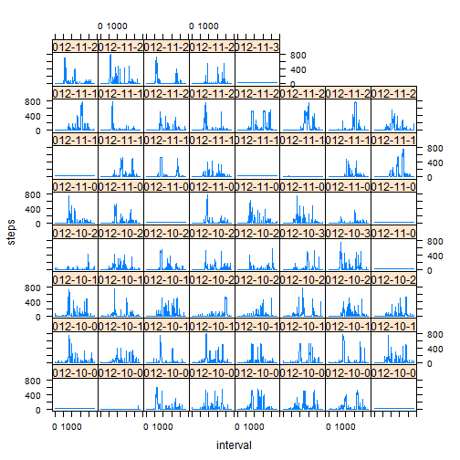

## Loading and preprocessing the data
download file, storing in temporary zip file  

```r
download.file("https://d396qusza40orc.cloudfront.net/repdata%2Fdata%2Factivity.zip",
              "temp.zip") 
```

unzip files from temporary zip file  

```r
unzip("temp.zip") 
```

read the only csv file listed, and store as object "DF""  

```r
DF <- read.csv(list.files(pattern = "csv"))
```

## What is mean total number of steps taken per day?
1. Calculate the total number of steps taken per day
for each date in DF, add all steps. Store result as dailySum  

```r
dailySum <- aggregate(formula = steps~date, 
                      FUN = sum, 
                      data = DF)
```
2. Make a histogram of the total number of steps taken each day

```r
hist(dailySum$steps, 
     xlab = "steps per day", 
     main = "Histogram of steps per day")
```

 
3. Calculate and report the mean and median of the total number of steps taken per day

```r
mean(dailySum$steps)
```

```
## [1] 10766.19
```

```r
# [1] 10766.19

median(dailySum$steps)
```

```
## [1] 10765
```

```r
# [1] 10766.19
```

## What is the average daily activity pattern?  
1. Make a time series plot (i.e. type = "l") of the 5-minute interval (x-axis) and the average number of steps taken, averaged across all days (y-axis)

```r
stepInterval <- aggregate(formula = steps~interval, 
                                  FUN = mean, 
                                  data = DF)

plot(steps~interval, data=stepInterval,type="l")  
```

 
2. Which 5-minute interval, on average across all the days in the dataset, contains the maximum number of steps?

```r
stepInterval[which.max(stepInterval$steps),"interval"]
```

```
## [1] 835
```

```r
# [1] 835
```

## Imputing missing values  
1. Calculate and report the total number of missing values in the dataset (i.e. the total number of rows with NAs)

```r
sum(is.na(DF$steps))
```

```
## [1] 2304
```

```r
# [1] 2304
```

2. Devise a strategy for filling in all of the missing values in the dataset.  
  
  Strategy: fill in missing values with mean value

3. Create a new dataset that is equal to the original dataset but with the missing data filled in.

4. Make a histogram of the total number of steps taken each day and Calculate and report the mean and median total number of steps taken per day. Do these values differ from the estimates from the first part of the assignment? What is the impact of imputing missing data on the estimates of the total daily number of steps?


```r
# fill missing values with mean:
newDF <- DF  
naVec <- is.na(newDF$steps)  
newDF[naVec,"steps"] <- mean(newDF[,"steps"],na.rm=T)

# construct histogram of sum of steps using new data
dailySum <- aggregate(steps~date,data=newDF,sum)
hist(dailySum[,"steps"], xlab = "sum of daily steps",main = "steps")
```

 

```r
# calculate mean:
mean(newDF$steps)
```

```
## [1] 37.3826
```

```r
# [1] 37.3826

# calculate median:
median(newDF$steps)
```

```
## [1] 0
```

```r
# [1] 0

# compare mean/median of DF and newDF:
data.frame(dataset=c("DF","newDF"),
           mean = unlist(lapply(list(DF$steps,newDF$steps),mean, na.rm = T)),
           median = unlist(lapply(list(DF$steps,newDF$steps),median, na.rm = T)))
```

```
##   dataset    mean median
## 1      DF 37.3826      0
## 2   newDF 37.3826      0
```
There is no difference between median & mean of DF and newDF. The histogram for newDF is slightly steeper than for DF

## Are there differences in activity patterns between weekdays and weekends?  
1. Create a new factor variable in the dataset with two levels - "weekday" and "weekend" indicating whether a given date is a weekday or weekend day.

```r
weekendVec <- as.POSIXlt(as.Date(newDF$date))$wday %in% c(0,6)
newDF <- cbind(newDF, dayType=weekendVec)
newDF[weekendVec,"dayType"] <- "weekend"
newDF[!weekendVec,"dayType"] <- "weekday"
```
2. Make a panel plot containing a time series plot (i.e. type = "l") of the 5-minute interval (x-axis) and the average number of steps taken, averaged across all weekday days or weekend days (y-axis). See the README file in the GitHub repository to see an example of what this plot should look like using simulated data.

```r
stepInterval <- aggregate(steps~interval+date,newDF,mean)
xyplot(steps~interval|factor(date),data=stepInterval,type="l")
```

 
